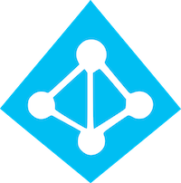
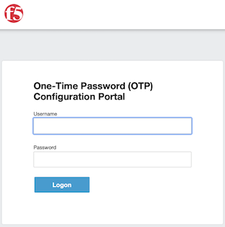

# F5 :: One-Time Password (OTP) application

    

## Overview

One-Time Password (OTP) application for F5 BIG-IP designed for deployments **without** external Multi-Factor Authentication (MFA) servers. This application uses pure Active Directory for user authentication and shared secret value storage. All you need after the installation of this application is to tell your users to download *AgileBits 1Password*, *Google Authenticator*, *Microsoft Authenticator* or any other OTP-compatible application to their mobile devices and start using Two-Factor Authentication (MFA) for your services.

This solution is based on:
* [RFC 4226](https://tools.ietf.org/html/rfc4226) - HOTP: An HMAC-Based One-Time Password Algorithm
* [RFC 6238](https://tools.ietf.org/html/rfc6238) - TOTP: Time-Based One-Time Password Algorithm

### Screenshots

 

## Requirements

Required systems for this application:
* BIG-IP LTM + APM + iRulesLX (*)
* Active Directory
* SMTP server
* OTP-compatible generator

\* - tested on version 14.x

## Installation

Please read [Installation Guide](docs/INSTALL.md) for instructions on installing OTP application on your BIG-IP. This guide is required to establish base configuration on BIG-IP which allows you to create OTP configuration portal and OTP verification procedures.

## Implementation

See [Implementation Guide](docs/IMPLEMENT.md) for instructions on how to integrate OTP verification procedures to APM-enabled virtual servers with **ACCESS_POLICY_AGENT_EVENT** support. In this document you will also find instructions on how to integrate OTP verification procedures with APM-enabled virtual servers without **ACCESS_POLICY_AGENT_EVENT** support or external applications that are able to send and receive HTTP validation requests.

## Troubleshooting

See [Troubleshooting Guide](docs/TSHOOT.md) for instructions on enabling debug log messages and decoding them correctly to understand how to debug installed application in your environment. You will find example log messages in this guide too.

## Architecture

Please take a look at the [Architecture Description](docs/ARCH.md) for detailed solution description with all caveats and drawbacks if you would like to know more about this application. This document contains schemes and explanations of various aspects of this solution. After reading this document you will be able to change and adapt this application to your environment.

## Credits

Full list of persons that helped located in [Credits](docs/CREDITS.md)
