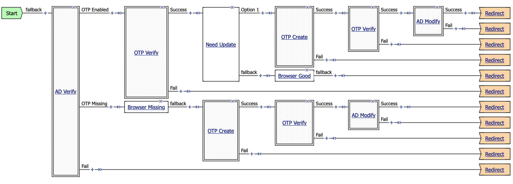

# Policy Description

This is a description of each element in Visual Policy Editor (VPE) which need to be created and configured in order to establish One-Time Password (OTP) configuration portal APM policy.

---

## Contents
1. Policy
2. Macro
   * AD Modify
   * AD Verify
   * Notify Admin
   * Notify User
   * OTP Assign
   * OTP Create
   * OTP Verify

## Policy



**Endings**

Name = `Redirect`

Type = Redirect [default]

Color = #3

Url = `https://otp.contoso.com/`

Close session after redirect = Enabled


**Need Update**
Type = Decision Box
Message = `One-Time Password (OTP) authentication token is already attached. Do you want to update it?`
Field 1 image = green icon
Option 1 = `Continue`
Field 2 image = red icon
Option 2 = `Exit`

**Browser Good**
Type = Message Box
Message = `One-Time Password (OTP) authentication token is already up-to-date`
Link = `Exit`

**Browser Missing**
Type = Message Box
Message = `One-Time Password (OTP) is enabled for your account but authentication token is missing. Please, click link below to attach new one`
Link = `Attach Token`

## Macro


### AD Modify

**LDAP Config**
Type = Variable Assign
session.custom.ldap.bind_scheme = `return {ldap://}`
session.custom.ldap.bind_fqdn = `return {corp.contoso.com}`
session.custom.ldap.bind_port = `return {389}`
session.custom.ldap.bind_dn = `return {CN=bigip2faldapuser,OU=Service Accounts,DC=corp,DC=contoso,DC=com}`
session.custom.ldap.bind_pwd = `return {COMPLEX_2FA_PASSWORD_STRING}` [Secure]
session.custom.ldap.user_dn = AAA dn
session.custom.ldap.user_attr = `return {extensionAttribute2}`
session.custom.ldap.user_value = `mcget -nocache {session.custom.otp.secret_value}`

**LDAP Modify**
Type = iRule Event
ID = `ldap_modify`
Successful = `expr {[mcget -nocache {session.custom.ldap.modify_result}] == 0}`

### AD Verify

**Browser Logon**
Type = Logon Page
Split domain from full Username = Enabled
Form Header Text = `One-Time Password (OTP) Configuration Portal`

**AD Auth**
Type = AD Auth
Server = **/CONTOSO/ActiveDirectory_aaa**

**AD Query**
Type = AD Query
Server = **/CONTOSO/ActiveDirectory_aaa**
SearchFilter = `sAMAccountName=%{session.logon.last.username}`
Fetch Nested Groups = Enabled
Required Attributes: **dn**, **extensionAttribute2**, **mail**, **memberOf**, **sAMAccountName**
memberOf and OTP = `expr {[mcget {session.ad.last.attr.memberOf}] contains "CN=OTP_Allow,OU=Service Groups,DC=corp,DC=contoso,DC=com" && [mcget {session.ad.last.attr.extensionAttribute2}] != ""}`
memberOf = `expr {[mcget {session.ad.last.attr.memberOf}] contains "CN=OTP_Allow,OU=Service Groups,DC=corp,DC=contoso,DC=com"}`

**Browser Deny**
Type = Message Box
Message = `You are not allowed to use this service. Please contact your system administrator`
Link = `Exit`


### Notify Admin

**Email**
Type = Email
SMTP Configuration = **/Common/CONTOSO-Authenticated_smtp**
From = `bigipsmtpuser@contoso.com`
To = `bigipadmins@contoso.com`
Subject = `%{session.access.profile} Internal Error`
Message =
```
Internal error occurred

Session ID: %{session.user.sessionid}

User DN: %{session.ad.last.attr.dn}
User Mail: %{session.ad.last.attr.mail}

User Agent: %{session.user.agent}
Platform: %{session.client.platform}
```

**Internal Error**
Type = Message Box
Message = `Internal error occurred. Please, try again later`
Link = `Exit`

### Notify User

**Email**
Type = Email
SMTP Configuration = **/Common/CONTOSO-Unauthenticated_smtp**
From = `noreply@contoso.com`
To = `%{session.ad.last.attr.mail}`
Subject = `OTP Updated`
Message = `One-Time Password (OTP) authentication token was successfully updated for session %{session.user.sessionid} from IP address %{session.user.clientip}`

**Action Done**
Type = Message Box
Message = `One-Time Password (OTP) authentication token was successfully updated`
Link = `Exit`


### OTP Assign

**OTP Config**
Type = Variable Assign
session.custom.otp.secret_value = AAA extensionAttribute2
session.custom.otp.secret_keyfile = `return {/CONTOSO/otpenc-key}`
session.custom.otp.secret_hmac = `return {sha1}`
session.custom.otp.otp_numdig = `return {6}`
session.custom.otp.timestep_value = `return {30}`
session.custom.otp.timestep_num = `return {1}`
session.custom.otp.user_name = AAA sAMAccountName
session.custom.otp.user_mail = AAA mail
session.custom.otp.security_attempt = `return {3}`
session.custom.otp.security_period = `return {60}`
session.custom.otp.security_delay = `return {300}`

### OTP Create

**OTP Create**
Type = iRule Event
ID = `otp_create`
Successful = `expr {[mcget -nocache {session.custom.otp.verify_result}] == 0}`

**QR Create**
Type = Variable Assign
session.custom.otp.qr_img = Paste contents of [qrcode.tcl](../ifiles/qrcode.tcl) file

**QR Display**
Type = Message Box
Message =
```
%{session.custom.otp.qr_img}
<p>Account: %{session.ad.last.attr.mail}</p>
<p>Secret: %{session.custom.otp.secret_value_dec}</p>
```
Link = `Verify`

### OTP Verify

**Browser OTP**
Type = Logon Page
Type = text; Post Variable Name = `otp_value`; Session Variable Name = `otp_value`
Type = **none**; Post Variable Name = password; Session Variable Name = password
Form Header Text = `Secure Logon`
Logon Page Input Field #1 = `One-Time Password`
Logon Button = `Submit`

**Check OTP Length**
Type = Empty
Equal = `expr {[string length [mcget {session.logon.last.otp_value}]] == [mcget {session.custom.otp.otp_numdig}]}`

**OTP Store**
Type = Variable Assign
session.custom.otp.otp_value = SESSION session.logon.last.otp_value

**OTP Verify**
Type = iRule Event
ID = `otp_verify`
Successful = `expr {[mcget -nocache {session.custom.otp.verify_result}] == 0}`
Locked User = `expr {[mcget -nocache {session.custom.otp.verify_result}] == 2}`
Failed Code = `expr {[mcget -nocache {session.custom.otp.verify_result}] == 3}`

**Browser Locked**
Type = Message Box
Message = `User locked out for %{session.custom.otp.security_delay} seconds. Please, try again later`
Link = `Exit`

**Browser Failed**
Type = Message Box
Message = `Code verification failed. Please, try again later`
Link = `Exit`

**Browser Invalid**
Type = Message Box
Message = `Code must be exactly %{session.custom.otp.otp_numdig} symbols`
Link = `Exit`
